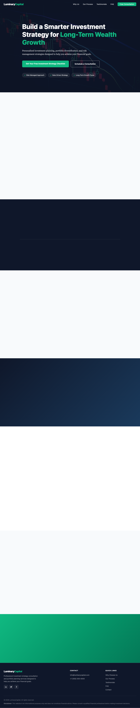

# Finance Consultancy — Landing Page

A single-file static landing page for an investment strategy consultancy. The entire site (HTML, CSS, and JavaScript) lives in `index.html` with no build step, no package manager, and no dependencies.



## Live Site

Deployed via GitHub Pages on every push to `main`.

## Running Locally

```bash
open index.html
```

No server required. All assets are self-contained or loaded from Unsplash CDN.

## Structure

Everything is in `index.html`, organized as:

- **`<style>`** — CSS using custom properties; Grid/Flexbox layout; responsive at 1024px, 768px, 620px
- **`<body>`** — Hero → Why Us (6 cards) → Process (4-step timeline) → Testimonials → Lead Magnet CTA → Contact form → FAQ accordion → Footer
- **`<script>`** — Vanilla JS: sticky nav, mobile hamburger, smooth scroll, IntersectionObserver animations, FAQ accordion, form validation + fetch submission

## Contact Form

Enquiry form posts to [FormSubmit](https://formsubmit.co/) with `fetch()` for a no-redirect JSON response. Inline success/error messages shown without page reload.

## Deployment

Push to `main` → GitHub Actions workflow (`.github/workflows/deploy.yml`) → GitHub Pages.
